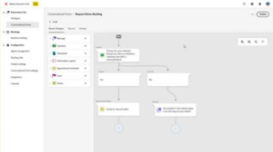

# [!DNL Marketo Engage] 튜토리얼

튜토리얼 라이브러리를 탐색하여 [!DNL Marketo Engage]을(를) 최대한 활용하십시오. 이 튜토리얼은 [[!DNL Marketo] 제품 설명서](https://experienceleague.adobe.com/docs/marketo/using/home.html?lang=ko-KR){target="_blank"}를 보완하여 마케팅 자동화 기능에 대한 이해를 높이는 데 도움이 됩니다.

<!-- 

 -->

## 새로운 기능 {#whats-new}

* [Adobe Identity Management으로 마이그레이션](https://experienceleague.adobe.com/en/docs/marketo-learn/tutorials/fundamentals/migrating-to-adobe-identity-management)
  _중앙 위치에서 사용자의 다른 Adobe 계정 및 제품과 함께 Adobe Marketo Engage 관리를 시작할 수 있도록 Adobe Identity Management 마이그레이션을 탐색하는 방법을 알아봅니다._

* [대화형 웨비나 이벤트 후 인사이트 및 조치](https://experienceleague.adobe.com/ko/docs/marketo-learn/tutorials/events/interactive-webinars-post-event-insights-and-actions)
  _대화형 웨비나 이벤트의 성능 및 참여에 대한 자세한 정보를 찾을 수 있는 위치를 알아봅니다._

* [Marketo API 사용 방법 비디오 - 변수에서 액세스 토큰을 설정하는 방법](https://experienceleague.adobe.com/ko/docs/marketo-learn/tutorials/integrations/api-set-access-token-variable)
  _Postman 응용 프로그램을 설정하는 방법과 변수를 활용하여 재사용 가능성을 위해 변수에 데이터를 저장하는 방법을 알아봅니다._

## 가장 인기 있는 비디오 {#most-popular-videos}

<table>
<tr>
<td>

<a href="https://experienceleague.adobe.com/ko/docs/marketo-learn/tutorials/programs-and-campaigns/smart-campaigns-101"><strong>스마트 캠페인 101</strong></a>

</td>
<td>

<a href="https://experienceleague.adobe.com/en/docs/marketo-learn/tutorials/dynamic-chat/conversational-forms"><strong>대화형 Forms</strong></a>

</td>
<td>

<a href="https://experienceleague.adobe.com/ko/docs/marketo-learn/tutorials/fundamentals/programs-and-campaigns"><strong>Marketo 프로그램 및 캠페인 이해</strong></a>

</td>
</tr>
</table>
