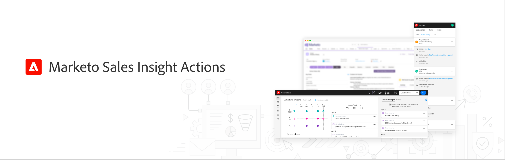

# Sales Insight Actions 자습서

단일 워크플로우에서 마케팅 기반의 인텔리전스 및 참여 도구를 함께 사용하여 전망 노력을 가속화하십시오.[!UICONTROL Sales Insight Actions]

>[!NOTE]
>
>Marketo Sales Insight Actions는 [Marketo Sales Insight 패키지](https://experienceleague.adobe.com/en/docs/marketo/using/product-docs/marketo-sales-insight/msi-for-salesforce/installation/install-marketo-sales-insight-package-in-salesforce-appexchange){target="_blank"}를 통해 Salesforce CRM과만 통합되는 웹 기반 애플리케이션입니다. 이를 때로 &quot;Marketo 영업&quot; 또는 간단히 &quot;작업&quot;이라고 합니다.

## 주요 자습서 {#featured-tutorials}

<table style="table-layout:fixed">
<tr>
<td>

<a href="/help/main/sales-insight-actions/sales-insight-actions-overview.md"><strong>영업 Insight 작업 개요</strong></a>

</td>
<td>

<a href="/help/main/sales-insight-actions/accessing-your-sales-insight-actions-instance.md"><strong>Sales Insight 작업 인스턴스에 액세스</strong></a>

</td>
<td>

<a href="/help/main/sales-insight-actions/configure-sales-activity-logging-to-salesforce.md"><strong>판매 활동 로깅을 [!DNL Salesforce]</strong></a>(으)로 구성

</td>
</tr>
</table>

## 주요 문서 {#featured-articles}

<table style="table-layout:fixed">
<tr>
<td>

<a href="https://experienceleague.adobe.com/docs/marketo/using/product-docs/marketo-sales-insight/actions/sales-insight-actions-feature-overview.html"><strong>영업 Insight 작업 기능 개요</strong></a>

<em>마케팅 기반의 인텔리전스 및 참여 도구를 통해 잠재 고객 확보를 가속화합니다.</em>

</td>
<td>

<a href="https://experienceleague.adobe.com/docs/marketo/using/product-docs/marketo-sales-insight/actions/getting-started/sales-insight-actions-user-onboarding-checklist.html"><strong>[!DNL Sales Insight Actions] 사용자 온보딩 가이드</strong></a>

<em>시작하려면 새 사용자가 따라야 하는 단계입니다.</em>

</td>
<td>

<a href="https://experienceleague.adobe.com/docs/marketo/using/product-docs/marketo-sales-insight/actions/admin/actions-data-sync-faq.html"><strong>작업 데이터 동기화 FAQ</strong></a>

<em>데이터 통합 동기화 작동 방식과 관련된 FAQ입니다.</em>

</td>
</tr>
</table>
